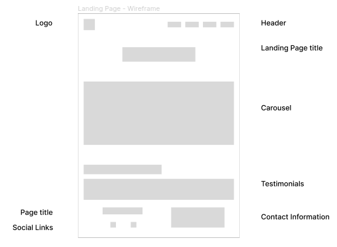
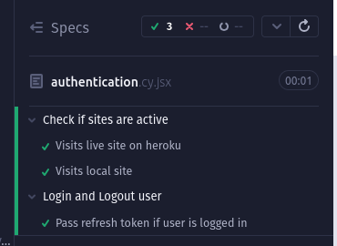

# Property UK

---

---

## Overview

- This repository is feature rich in functionality for new properties to be displayed.
- It allows buyers to report Maintenance issues with ease.
- While seeing all the details on the property that they are renting.
- This repository allows sellers to upload their property with all the current details on the site.

Live site [here](https://ci-pp5-property-react-1c4b35a4e2b5.herokuapp.com/)

---

[//]: # "Badges"

---

## Table of Content

- [Planning](#planning)
  - [How to install this project](#how-to-install-this-project)
  - [Wireframes](#wireframes)
  - [UX/UI Designs on figma](#uxui-designs-on-figma)
  - [Color pallet](#color-pallet)
  - [User Stories using MOSCOW Prioritization techniques](#user-stories-using-moscow-prioritization-techniques)
  - [Proper Description of the Technologies used in the Project](#proper-description-of-the-technologies-used-in-the-project)
- [Features](#features)
  - [Atomic Design](#atomic-design)
  - [Header](#header)
  - [State Store](#state-store)
  - [Special features on the about page](#special-features-on-the-about-page)
- [Testing](#testing)
  - [Automatic testing using cypress](#automatic-testing-using-cypress)
  - [Manual testing](#manual-testing)
- [Bugs](#bugs)
  - [401 Error](#401-error)
  - [Carousel](#carousel)
  - [Error when sending property data to API](#error-when-sending-property-data-to-api)
  - [403 forbidden on logout](#403-forbidden-on-logout)
  - [Map doesn't have its own key](#map-doesnt-have-its-own-key)
  - [Modal background to dark on Table display](#modal-background-to-dark-on-table-display)
  - [Footer](#footer)
  - [Footer email address off-screen](#footer-email-address-off-screen)
  - [does not want to refresh page on delete](#does-not-want-to-refresh-page-on-delete)
- [Credits](#credits)

---

### [Planning](#table-of-content)

#### [How to install this project](#table-of-content)

Locally

- To download this repo, install it using git clone or ssh
- Clicking the Green code button above and selecting your preferred installation method
- Then run npm install to install all the required React packages
- Once all required packages are installed, you can run React using the following command
- $ npm start

Heroku

- This Project is running live on heroku
- When on the heroku app click the new button to create a new heroku project
- Under the deploy tab connect Gibhub to this heroku project
- scroll down until you see manual deploys
- click the purple button that says Deploy branch
- just to make sure that it deploys correctly being a first time
- If everything seems right then you can enable automatic deploys

#### [Wireframes](#table-of-content)

- Landing Page (HomePage)

- About Page

- Admin Dashboard Page—Profiles of the users using the site

- Admin Dashboard Page - displaying of the users

- User Dashboard Page

#### [UX/UI Designs on figma](#table-of-content)

- Landing Page (HomePage)

- About Page

- Admin Dashboard Page—Profiles of the users using the site

- Admin Dashboard Page - displaying of the users

- User Dashboard Page

#### [Color Pallet](#table-of-content)

Our Website features a modern and elegant color palette designed to create a visually appealing
and user-friendly experience.
The colors have been carefully selected to convey professionalism, trust and sophistication,
which are essential for a property website.

- Headings, Buttons, Links and Text: Pine Tree Green (#2F301D)—This color was chosen as a way to make certain elements stand out within the page
- Secondary text: Ash Gray (#BFBFA7) - This color was used as a paragraph text just under the heading to explain what was to come.
- Background: The soft white provides a clean canvas that enhances readability and focus on content.

#### [User Stories using MOSCOW Prioritization techniques](#table-of-content)

##### Description

- I tried my best to follow the Agile methodology
- Starting with the completion of the landing page
- Once that was completed, then move on to the next section
- Creating this project page by page
- I first start with creating all the issues needed for the Landing Page
- GitHub bot would move that to backlog and I would move it to Ready
- Then, before I started the cards for the Landing Page, I would create cards for the About Page
- Trying to always have something in the Backlog section of the Kanban board

##### Milestones

Landing Page

- The percentage of milestones completed
- 66% complete
- Open 5
- Ten closed

About Page

- The percentages of milestones completed
- 60% complete
- Open 9
- Fourteen closed

#### [Proper Description of the Technologies used in the Project](#table-of-content)

---

### [Features](#table-of-content)

#### [Atomic Design](#table-of-content)

##### Description

Atomic design, developed by Brad Frost and Dave Olsen,
is a methodology for crafting design systems with five fundamental building blocks
which, when combined, promote consistency, modularity and scalability.

The five building blocks are Atoms, Molecules, Organisms, Templates and Pages

##### Atoms

Basic building blocks of matter, such as a button, input and a form label.
They're not useful on their own.

##### Molecules

Grouping atoms together, such as combining a button, input and form label to build functionality.

##### Organisms

Combining molecules together to form organisms that make up a distict section of an interface (i.e. navigation bar)

##### Templates

Consisting mostly of groups of organisms to form a page - where clients can see a final design in place.

##### Pages

An ecosystem that views different template renders. We can create multiple ecosystems into a single environment - the application.

If you want a better explanation,
take a look at this [article](https://andela.com/blog-posts/structuring-your-react-application-atomic-design-principles)

#### [Header](#table-of-content)

##### Brief Description

- When the page is on larger devices, there will be links on the right and the logo on the left

- When the responsiveness of the page changes from tablet to smaller the links become a hamburger menu
- There is also functionality to show if the hamburger menu is open or closed
- Image below shows that the menu is closed

- Image below shows that the menu is open

#### [State Store](#table-of-content)

##### Description

A state store in React refers to a centralized place to manage the state of an application.
This concept is particularly useful for large applications where multiple components need to share and update the same state.
Using state store helps to manage and coordinate state changes more efficiently, avoiding issues like prop drilling and inconsistent
states across components.

- This state store was done as a way of reducing Prop drilling within my application
- I have also made use of local storage to increase user performance
- I have used React hooks to store and retrieve state
- The hooks that I have used are useMemo, useReducer and useContext
- useMemo - this is used to memorize state, in order to reduce re-renders
- useReducer - this hook is used to manage complex state within an application, when specific state has to many sub levels
- useContext - this hook is used to share state accross the application, globally

#### [Special features on the about page](#table-of-content)

- Added About us, mission and commitment to our customers

---

### [Testing](#table-of-content)

#### [Automatic testing using cypress](#table-of-content)

##### Description

- Cypress is a testing framework for React and other UI libraries
- It is used as a fully automated system
- Testing how each component can interact with each other
- In order to work with cypress, make sure that React is still running
- Open up a new terminal
- There is a script that I have created for cypress in package.json
- run the command $ npm run cypress
- This will then open up a new browser window inorder to run cypress
- select the one that says e2e

##### Authentication testing

###### Failing test?

- tested against the incorrect login credentials
- username: admin
- password: admin

###### Passing the test?

- tested against the correct login credentials
- username: test
- password: IAMininGLOrN

##### [Manual Testing](#table-of-content)

Lighthouse testing

HTML validation test

CSS validation test

---

### [Bugs](#table-of-content)

#### [401 Error](#table-of-content)

##### Problem?

- 401 get request unauthorized error in console
- this error only happens when I am not logged in
- when it is trying to make a get request to the API

##### Solution?

- I have added login to only send a request if there is a refresh-token in the Cookie store

#### [Carousel](#table-of-content)

##### Problem?

- The carousel is not changing correctly when adjusting the screen width
- It should be changing from animated design to standing carousel

- When the width gets adjusted, it also doesn't want to resize the image correctly

- when it is rotating and enlarging the images, it seems to shrink and enlarge the hole page
- normally just a refresh does this

##### Solution?

- This animated design seems to be to complecated for my intensions
- It has since been taken out of my designs
- Rather have a standing carousel that rotates every 10 seconds

#### [Error when sending property data to API](#table-of-content)

Problem?

- When I try to send data to API
- It sends me a 500 error code
- When it should only send a message
- This is even if I am logged in

Solution?

- This has not been solved yet?

#### [403 forbidden on logout](#table-of-content)

Problem?

- When I click on logout
- It comes with a forbidden error message
- but if I have to refresh the page then it is fine, and it shows as if I am logged out
- this error only happens sometimes not all the time

Solution?

- I can now log out with a form box asking for permission first

#### [Map doesn't have its own key](#table-of-content)

Problem?

- For some reason, the body of the table when mapping
- I can't seem to add a unique id
- From what I gather, it is just when I am developing locally

Solution?

- This Problem has not been solved yet

#### [Modal background to dark on Table display](#table-of-content)

Problem?

- For some reason, the modal is in a very dark background
- Making it pitch black, so that nothing can be seen in the background
- This only happens on laptop and larger devices

- This is how it should look

Solution?

- This problem has not been solved yet

#### [Footer](#table-of-content)

##### Problem?

- When scaling down, the image is slightly off
- This is just above 300 pixels

##### Solution?

- This has not been solved yet

#### [Footer email address off-screen](#table-of-content)

Problem?

- When scaling down between 400pixels and 300 pixels
- The email address is too long
- It goes off the screen

Solution?

- Styled h4 heading and thumbnail to be smaller
- on smaller devices

#### [does not want to refresh page on delete](#table-of-content)

Problem?

- The deleting of the user's profile
- Will delete but for some reason it does not want to refresh the page
- If you manually refresh, then it will show

Solution?

- This problem has not been solved

---

### [Credits](#table-of-content)

- Iteration over function with the state store [here](https://stackoverflow.com/questions/59200785/react-usereducer-how-to-combine-multiple-reducers)
- Assisted in helping me get the state store correct [here](https://ricostacruz.com/til/state-management-with-react-hooks)
- Article that assisted in iterating over [reducer](https://stackoverflow.com/questions/59200785/react-usereducer-how-to-combine-multiple-reducers) functions
- Article that helps get the [state store](https://ricostacruz.com/til/state-management-with-react-hooks) up and running
- Article for getting superuser right with shell terminal [here](https://stackoverflow.com/questions/11337420/can-i-use-an-existing-user-as-django-admin-when-enabling-admin-for-the-first-tim)
- Help to get the tokens correct [here](https://medium.com/django-unleashed/securing-django-rest-apis-with-jwt-authentication-using-simple-jwt-a-step-by-step-guide-28efa84666fe)

---
